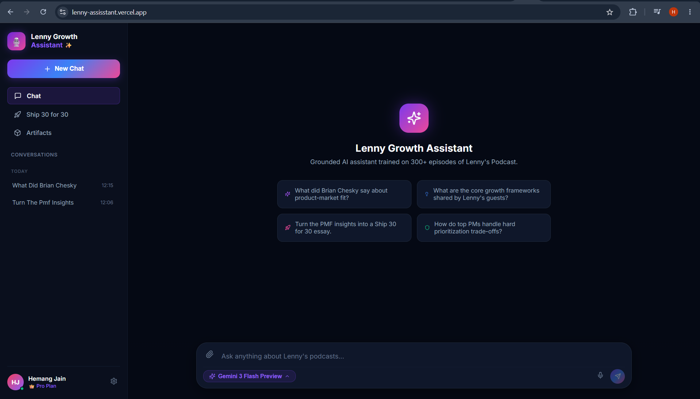
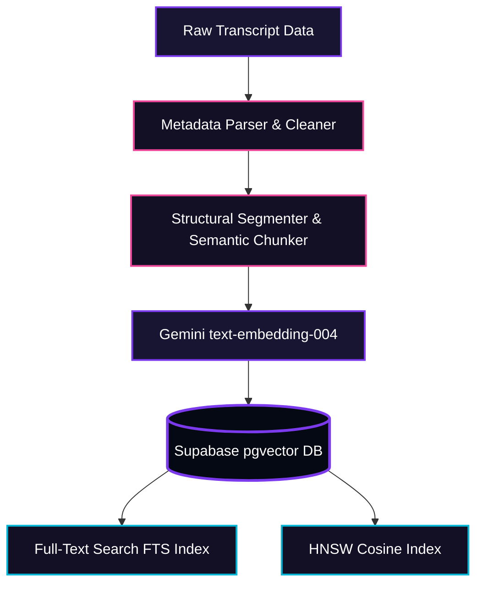

# 🚀 Lennys Growth Assistant

**Submitted by:** Hemang Jain  
**Assessment:** FORWARD DEPLOYED ENGINEER • TAKE-HOME ASSESSMENT  
**Deployed Link:** <a href="https://lenny-assisstant.vercel.app/"> https://lenny-assisstant.vercel.app/ </a>

---

<p align="center">
  
  
  
  
</p>

---

## 📸 Application Interface Preview
Here is a preview of the **Lennys Growth Assistant** dashboard, featuring a beautiful dark violet premium UI, three-column layout, and interactive artifacts sliding panel:

<p align="center">
  
</p>

> 💡 *Note: This screenshot showcases the interactive 3-panel workspace, including live-streaming chat sessions, grounding reasoning, clickable timestamp citations, and the interactive side-panel table-of-contents.*

---

## 🎙️ About Lenny's Podcast
**Lenny's Podcast** is the #1 product and growth podcast in the world. Hosted by Lenny Rachitsky, it features in-depth interviews with world-class product leaders, growth practitioners, and legendary founders to uncover actionable frameworks, templates, and execution-level tactics.

## 💡 Why the Growth Assistant is Needed
With hundreds of episodes and thousands of hours of high-value conversational audio, product managers, founders, and growth professionals face immense noise when seeking specific, actionable insights. Finding a specific framework—such as *Anya Smith's cold-start strategy*, *Reforge's retention benchmarks*, or *Figma's early activation milestones*—requires digging through pages of unstructured transcripts or watching hours of video.

The **Lenny Growth Assistant** bridges this gap. It is an advanced, production-grade hybrid RAG (Retrieval-Augmented Generation) application designed to turn conversational transcript data into an interactive, grounded, and fully cited knowledge workspace.

---

## 🔥 Key Features
*   **🔍 Hybrid Search Engine**: Integrates dense vector search (using Google Gemini Embeddings in Supabase `pgvector`) with sparse lexical full-text search (PostgreSQL FTS) for maximum accuracy.
*   **🤖 "Pi" Bounded Agentic Loop**: A multi-turn orchestrator that manages complex reasoning, conversational query rewriting, and multi-query synthesis.
*   **📋 Claude-Style Interactive Artifacts**: Generates structured, high-value resources (like essays, markdown tables, or functional HTML checklists) in a dedicated slide-over panel.
*   **🔗 Exact Timestamp Citations**: Every factual claim is referenced with clickable YouTube links that jump straight to the exact second the guest said it.
*   **🛡️ Multi-Tier Prompt Defense**: Employs rigorous XML context containment and Sandwich Prompting to prevent instruction override and system-prompt extraction.

---

## 🏗️ Data Ingestion Pipeline

The data ingestion pipeline parses, cleanses, segments, embeds, and indexes conversational transcript data to make it optimized for hybrid search.



### 🎯 Scope Choices

#### What We Included & Why:
1.  **Reciprocal Rank Fusion (RRF)**: Fuses vector distance scores and full-text search rankings to bring the absolute best-matching segments to the top.
2.  **Cross-Encoder Reranker (Cohere)**: Performs high-precision relevancy scoring on top-N candidates to refine results, prioritizing semantic context over token frequencies.
3.  **Maximal Marginal Relevance (MMR)**: Intentionally filters and diversifies search results to prevent the LLM context from being filled with repetitive statements from the same episode.
4.  **Smart Context Expansion**: Automatically pulls adjacent chunks preceding and succeeding a highly relevant match, providing the LLM with the complete conversational thread.

---

## ⚖️ Risks and Trade-offs
1.  **Hallucination Risk**: Large models often hallucinate frameworks or misattribute them to guests.  
    *Mitigation*: We isolate all retrieved transcripts inside strict `<retrieved_lenny_transcripts>` XML elements. A dedicated **Grounding Verifier** post-processing node evaluates the response line-by-line against actual transcripts before finalizing output.
2.  **Latency vs. Quality**: Combining multi-query expansion, hybrid search, RRF, reranking, and agentic reasoning adds processing steps.  
    *Mitigation*: All vector and lexical database queries are run in parallel asynchronously. Response text is delivered token-by-token using **Server-Sent Events (SSE)** to provide a fast perceived speed.
3.  **API Costs**: Heavy usage of Cohere Reranking and Gemini embeddings could scale costs quickly.  
    *Mitigation*: We strictly limit reranking candidate size to the top-10 elements, and utilize a bounding strategy to shrink the retrieved context size before LLM synthesis.
4.  **Local-Model Quality**: Running models like Llama 3.1 on Ollama locally lowers operational costs but requires heavy local resources (VRAM) and limits reasoning capabilities.  
    *Mitigation*: Built a dual-backend capability. You can seamlessly toggle between Google Gemini (Cloud) and Llama 3.1 (Ollama Local) depending on environment resources.
5.  **Unsafe Artifact Rendering**: Allowing the LLM to generate custom HTML layouts risks Cross-Site Scripting (XSS) if the generated code is malicious or includes unauthorized script elements.  
    *Mitigation*: HTML previews are rendered inside a strictly sandboxed `<iframe>` element without `allow-same-origin`, preventing scripts from interacting with the main site DOM, cookies, or localStorage.

---

## 🤖 "Pi" Agent Orchestration Layer

The **Pi Orchestrator** is a bounded agentic reasoning layer that wraps the LLM, managing multi-step query resolution, retrieval strategies, and post-generation grounding.

```mermaid
flowchart TD
    %% Define Styles
    classDef startEnd fill:#050914,stroke:#7C3AED,stroke-width:3px,color:#fff,font-weight:bold;
    classDef process fill:#131026,stroke:#EC4899,stroke-width:2px,color:#fff;
    classDef decision fill:#181532,stroke:#06B6D4,stroke-width:2px,color:#fff;
    classDef db fill:#0A0F1D,stroke:#10B981,stroke-width:2px,color:#fff;

    %% Nodes
    A[User Query & Chat History]:::startEnd --> B{Node 1: Intent Classification}:::decision
    
    B -- Chitchat / Out of Domain --> C[Direct Non-RAG Route]:::process
    B -- RAG Route --> D[Node 2: Conversational Query Rewriter]:::process
    
    D --> E{Complex / Synthesis?}:::decision
    E -- Yes --> F[Node 3: Query Decomposer & Expander]:::process
    E -- No --> G[Node 4: Hybrid RAG Retriever]:::process
    
    F --> G
    
    G --> H[(Supabase Vector & FTS DB)]:::db
    H --> I[RRF, Cohere Rerank & MMR Filter]:::process
    I --> J[Node 5: LLM Response Generator]:::process
    
    J --> K[Node 6: Grounding & Citation Verifier]:::process
    K --> L[SSE Streaming Output with Citations]:::startEnd

    %% Assign styles to specific nodes
    style B fill:#1e1a3a,stroke:#EC4899
    style E fill:#1e1a3a,stroke:#EC4899
    style H fill:#0f2c20,stroke:#10B981
```



### 🧩 Node Breakdown & Purpose

*   **Node 1: Intent Classification (`classify_query`)**  
    *What it does:* Analyzes the user's prompt to identify if it's chitchat, out-of-domain, or a target RAG query.  
    *Why:* Prevents expensive, slow database lookups for simple greetings (e.g. "hi") or completely off-topic questions.
*   **Node 2: Conversational Query Rewriter**  
    *What it does:* Inspects previous chat history to resolve pronouns and implicit references (e.g., rewriting "what did he say about that?" to "What did Lenny Rachitsky say about product-market fit milestones?").  
    *Why:* Standard vector searches fail on pronouns. This guarantees we search the DB using fully contextualized keywords.
*   **Node 3: Query Decomposer & Expander**  
    *What it does:* Expands a complex, comparative user question into 2-4 distinct subqueries (e.g. breaking "Compare Figma's and Slack's growth loops" into two targeted queries).  
    *Why:* Ensures we extract highly specific context blocks for both comparison subjects instead of retrieval getting dominated by just one.
*   **Node 4: Hybrid RAG Retriever**  
    *What it does:* Executes dense cosine-similarity searches and keyword searches against the Supabase database.  
    *Why:* Dense search captures semantic meaning, while full-text search guarantees exact keyword/name matches.
*   **Node 5: LLM Response Generator**  
    *What it does:* Combines retrieved transcripts inside strict XML tags and performs **Sandwich Prompting** to generate the streaming answer text.  
    *Why:* Secures the LLM from prompt injection while synthesizing a highly readable, grounded response.
*   **Node 6: Grounding & Citation Verifier**  
    *What it does:* Evaluates the synthesized response against the raw text of the source transcripts, injecting clickable timestamp hyperlinks.  
    *Why:* Acts as a final security guard completely blocking hallucinations and ensuring full auditability of every assertion.

---

## 🎨 Claude-Style Interactive Artifact Panel

The **Artifact Panel** is an interactive, slide-over workspace inspired by Claude. When the Pi Orchestrator detects that a user request involves structured outputs (like an in-depth PM checklist, a SaaS pricing table, or a custom HTML layout), it uses the `<artifact>` tag to stream this content directly into a side-by-side workspace. 

Users can seamlessly toggle between a high-fidelity **Preview tab** and a raw **Code tab**, navigate complex documents instantly using a dynamically generated **Table of Contents**, copy content with a single click, and **Export / Download** the artifact to their local machine in Markdown or HTML formats.

---

## 🚀 Setup & Local Execution

This project is fully containerized using Docker, allowing you to spin up the frontend, backend, and a local Ollama instance with a single command.

### 🔑 1. Configure Environment Variables

Create `.env` files in both the `frontend` and `backend` directories.

#### 📁 Backend configuration (`backend/.env`)
```env
# ── APPLICATION ──
ENVIRONMENT=development
LOG_LEVEL=INFO

# ── SUPABASE / POSTGRES DATABASE CREDENTIALS ──
SUPABASE_URL=https://<your-project-ref>.supabase.co
SUPABASE_SERVICE_ROLE_KEY=your_supabase_service_role_key_here
SUPABASE_ANON_KEY=your_supabase_anon_public_key_here
DATABASE_URL=postgresql://postgres:<password>@db.<your-project-ref>.supabase.co:5432/postgres

# ── GEMINI API ──
GEMINI_API_KEY=your_gemini_api_key_here

# ── RERANKERS (COHERE / VOYAGE AI) ──
COHERE_API_KEY=your_cohere_api_key_here
VOYAGEAI_API_KEY=your_voyageai_api_key_here

# ── OLLAMA CLOUD (OPTIONAL) ──
OLLAMA_CLOUD_API_KEY=
OLLAMA_CLOUD_BASE_URL=

# ── CORS ──
FRONTEND_ORIGIN=http://localhost:3000
```

#### 📁 Frontend configuration (`frontend/.env`)
```env
# ── BACKEND API ──
BACKEND_ORIGIN=http://localhost:8000

# ── SUPABASE (Read-only anonymous client access) ──
NEXT_PUBLIC_SUPABASE_URL=https://<your-project-ref>.supabase.co
NEXT_PUBLIC_SUPABASE_ANON_KEY=your_supabase_anon_public_key_here
```

### �️ 2. Supabase / PostgreSQL Database Setup

Before running the application, you must initialize your database schema. If you are using Supabase, you can set up all the necessary extensions, tables, vector columns, and indexes easily through the **SQL Editor**:

1. Go to your **Supabase Dashboard** and open your project.
2. In the left-hand navigation, click on **SQL Editor** (the `>_` icon).
3. Create a **New Query**.
4. Paste and execute the following SQL scripts (found in `backend/database/migrations/`) in sequential order:

---

### 🐳 3. Run with Docker Compose

Once you have set up your `.env` files, launch the application stack from the root directory:

```bash
docker-compose up --build
```

This single command:
1.  Downloads and sets up **Ollama** running a local `llama3.1` model.
2.  Builds and starts the production-ready **FastAPI** backend service on `http://localhost:8000`.
3.  Builds and serves the custom dark-violet **Next.js** frontend dashboard on `http://localhost:3000`.

---
