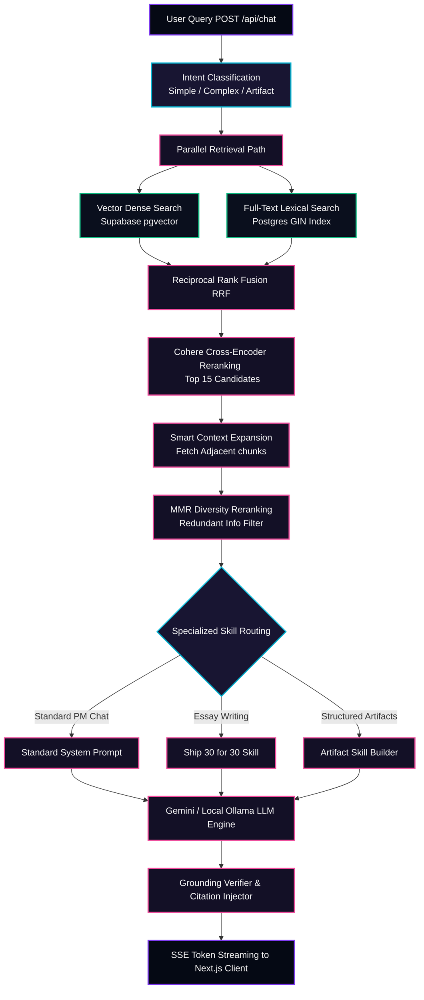

# ⚙️ Lenny Growth Assistant - FastAPI Backend Service

This directory contains the production-optimized, vector-based **FastAPI** backend that powers the **Lenny Growth Assistant**. It leverages hybrid search, cross-episode Reciprocal Rank Fusion (RRF), Cohere Cross-Encoder Reranking, smart context expansion, math-based Maximal Marginal Relevance (MMR) diversity filtering, and a custom multi-turn reasoning agent loop.

---

<p align="center">
  
  
  
  
  
</p>

---

## ── 1. ARCHITECTURAL FLOW

When a user query is received, the backend processes it through a robust, low-latency search, ranking, and generation pipeline. The entire flow is visualized in the Mermaid diagram below:



---

## ── 2. CORE FEATURES

*   **🔍 Hybrid Retrieval Engine**: Pairs semantic dense vector search (using Google Gemini `text-embedding-004` at 768 dimensions in Supabase `pgvector`) with sparse Full-Text Search (FTS) in PostgreSQL for maximum recall and keyword accuracy.
*   **➕ Reciprocal Rank Fusion (RRF)**: Merges sparse keyword search rankings and dense vector search results into a single optimized candidate pool.
*   **🎯 Cross-Encoder Reranking**: Uses Cohere's powerful cross-encoders to score the absolute relevance of the top-15 retrieved transcript chunks.
*   **🧠 Bounded Agentic Reasoning Loop ("Pi")**: Wraps the core LLM execution in a robust reasoning loop that handles intent classification, conversation-aware query re-writing, and multi-query decomposition.
*   **🛡️ Injection-Resistant Prompt Design**: Isolates transcript context inside strict `<retrieved_lenny_transcripts>` XML tags with Sandwich Prompting to prevent prompt-injection attacks.
*   **⚖️ MMR Diversity Reranking**: Utilizes Maximal Marginal Relevance (MMR) mathematics to filter out redundant context from the same speaker and expand the diversity of insights.

---

## 🤖 Bounded Agentic Reasoning Loop

The **Pi Orchestrator** governs the backend lifecycle of a query:

```mermaid
flowchart TD
    classDef startEnd fill:#050914,stroke:#7C3AED,stroke-width:3px,color:#fff,font-weight:bold;
    classDef process fill:#131026,stroke:#EC4899,stroke-width:2px,color:#fff;
    classDef decision fill:#181532,stroke:#06B6D4,stroke-width:2px,color:#fff;
    classDef db fill:#0A0F1D,stroke:#10B981,stroke-width:2px,color:#fff;

    A[User Query & Chat History]:::startEnd --> B{Intent Classification}:::decision
    
    B -- Chitchat / Out of Domain --> C[Direct Non-RAG Route]:::process
    B -- RAG Route --> D[Conversational Query Rewriter]:::process
    
    D --> E{Complex / Synthesis?}:::decision
    E -- Yes --> F[Query Decomposer & Expander]:::process
    E -- No --> G[Hybrid RAG Retriever]:::process
    
    F --> G
    
    G --> H[(Supabase Vector & FTS DB)]:::db
    H --> I[RRF, Cohere Rerank & MMR Filter]:::process
    I --> J[LLM Response Generator]:::process
    
    J --> K[Grounding & Citation Verifier]:::process
    K --> L[SSE Streaming Output with Citations]:::startEnd

    style B fill:#1e1a3a,stroke:#EC4899
    style E fill:#1e1a3a,stroke:#EC4899
    style H fill:#0f2c20,stroke:#10B981
```



---

## ── 3. LOCAL MANUAL STARTUP (FOR DEVELOPMENT)

### 1. Configure the Virtual Environment
```bash
# Navigate to backend folder
cd backend

# Create virtual environment
python -m venv venv

# Activate virtual environment
venv\Scripts\activate     # On Windows
source venv/bin/activate  # On macOS/Linux
```

### 2. Install Dependencies
```bash
pip install -r requirements.txt
```

### 3. Setup Environment Variables
Copy `.env.example` to `.env` and fill in your Gemini and Cohere keys (database keys are pre-configured for your convenience!):
```bash
cp .env.example .env
```

### 4. Run the API Server
```bash
python -m uvicorn app.main:app --reload --port 8000
```
The server will start on [http://localhost:8000](http://localhost:8000). You can explore the interactive Swagger documentation at [http://localhost:8000/docs](http://localhost:8000/docs).

---

## ── 4. INGESTION PIPELINE

To structurally segment, chunk, embed, and sync local episode transcripts into your Supabase Postgres schema:
```bash
python -m ingestion.sync --source ../lennys-podcast-transcripts/episodes --incremental
```

---

## ── 5. RUNNING TESTS

The backend has an extensive pytest-driven unit testing and integration suite:
```bash
python -m pytest tests
```
*Tests cover MMR mathematical diversity correctness, configuration parsing, routing fallbacks, and API status codes.*
