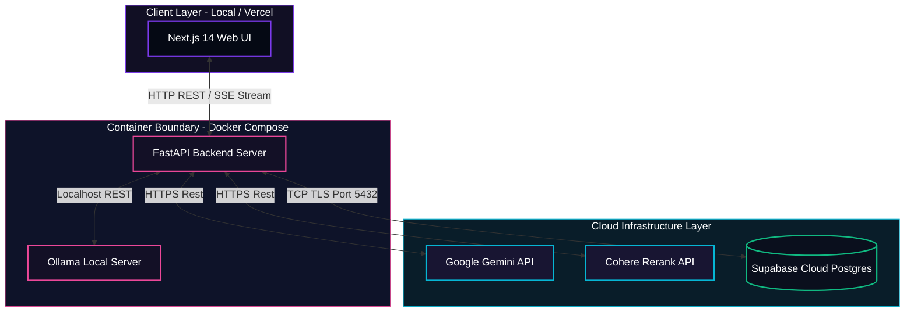
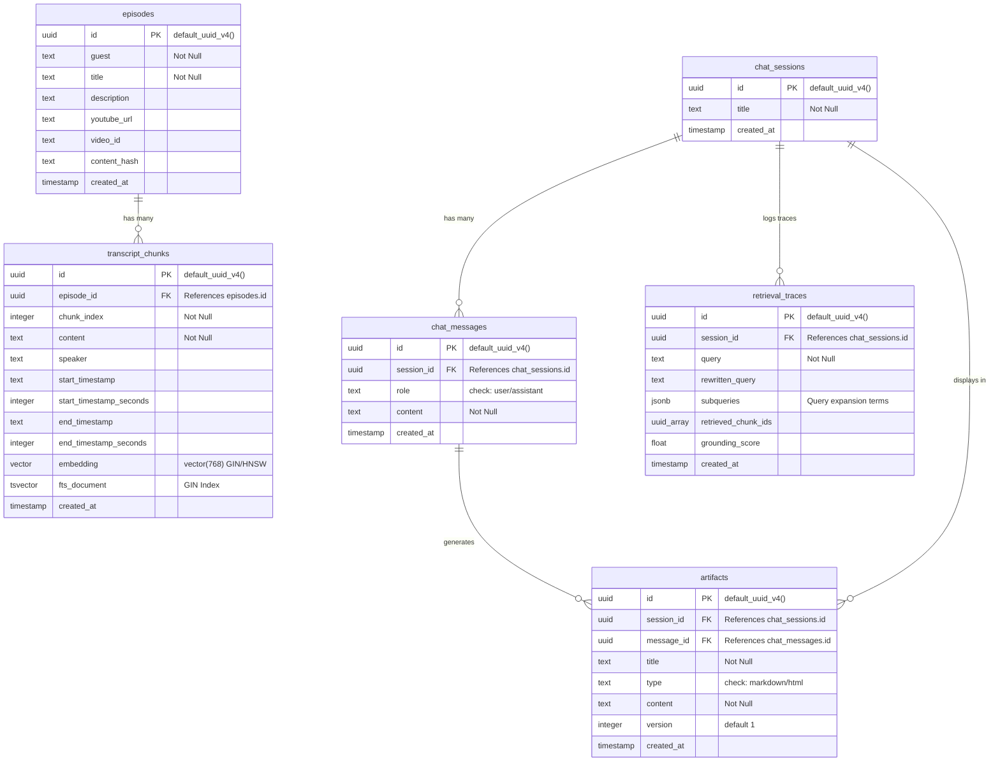

# 🏗️ System Architecture, Topology & Design Decisions

Welcome to the technical architecture design document for **Lenny's Growth Assistant**. This document explores the underlying problem space, data pipelines, database models, system boundary setups, security policies, and the engineering rationale behind our core technology choices.

---

## 1. Introduction and Problem Space

### ❌ The Core Problem
Lenny's Podcast hosts rich, multi-hour discussions with world-class product leaders, startup founders, and growth practitioners. However, this conversational data is highly unstructured, lengthy, and noisy. 
1.  **Search Blindness**: Keyword search (lexical search) is unable to match high-level growth philosophies or abstract frameworks if exact keywords aren't present in the transcript.
2.  **Context Limitations ("Lost in the Middle")**: Standard RAG architectures retrieve large blocks of disjointed conversation, which can bloat the LLM prompt, degrade generation quality, and cause latency spikes.
3.  **Hallucination & Misattribution**: LLMs easily hallucinate concepts, inventing metrics or wrongly attributing a specific growth strategy to the wrong podcast guest.
4.  **No Actionable Assets**: Standard chats return conversational text, failing to extract high-utility tools like checklist playbooks, tables, or step-by-step launch essays.

### 🎯 The Solution
The **Lenny Growth Assistant** resolves this with an advanced hybrid RAG backend and a highly engaging, interactive three-panel frontend. By embedding conversational paragraphs, fusing dense and sparse search rankings, expanding adjacent contexts, routing queries through specialized agentic reasoning states, and verifying responses against raw transcripts, we deliver highly contextualized, verifiable answers and interactive artifacts (Claude-Style).

---

## 2. Component Boundaries and Deployment Topology

The application is designed around clean microservice boundaries, containerized via Docker, and deployed in a hybrid cloud-local topology.

### ⚙️ Architectural Decisions & Rationale
1.  **FastAPI (Backend)**: Chosen for its native support for asynchronous event loops, built-in type validation via Pydantic, and low-overhead streaming (SSE) support which is critical for real-time conversational apps.
2.  **Next.js (Frontend)**: Standardized on App Router for optimal server-side pre-rendering, seamless routing, and client-side reactive components.
3.  **Hybrid Cloud-Local Model Toggle**: 
    *   *Cloud Path (Gemini)*: Fast, scalable, and highly performant reasoning capability for complex, multi-turn synthesis.
    *   *Local Path (Ollama Llama 3.1)*: Fully operational offline reasoning path for high data privacy and zero external operational reasoning cost.
    *   *Robust Failover*: If local system resource limits degrade or external APIs fail, the orchestrator automatically routes the stream through the available fallback.

---

## 3. Database Schema and Graphical ERD

The database runs on **PostgreSQL** inside Cloud Supabase, empowered by `pgvector` for vector similarity and relational integrity to track chat sessions, messages, artifacts, and retrieval traces.

### ⚡ Database Rationale & Scalability Features
1.  **Relation Integrity over Vector Databases**: Standard vector databases (e.g. Pinecone) are stateless and separate from relational data, requiring complex synchronization. Using PostgreSQL with `pgvector` lets us perform high-speed vector queries, full-text searches, and manage relational chat sessions inside a single, unified, ACID-compliant database.
2.  **HNSW Indexing (Hierarchical Navigable Small World)**:
    - Cosine distance operations are accelerated using an HNSW index (`tc_hnsw_cosine_idx`).
    - HNSW constructs a multi-layer graph to achieve logarithmic query times ($\\mathcal{O}(\\log N)$), ensuring sub-10ms similarity queries even as transcripts scale to millions of rows.
3.  **GIN Indexing (Generalized Inverted Index)**:
    - Configured for PostgreSQL Full-Text Search on a trigger-computed `tsvector` column (`fts_document`).
    - It maps words to their containing rows, bypassing slow sequential scans ($\\mathcal{O}(N)$) during keyword-focused retrieval.

---

## 4. Data Ingestion Flow

The ingestion process runs on a custom modular python pipeline. It takes raw text transcripts and converts them into semantically indexed database rows.

```mermaid
flowchart TD
    %% Define Styles
    classDef file fill:#181532,stroke:#7C3AED,stroke-width:2px,color:#fff;
    classDef logic fill:#131026,stroke:#EC4899,stroke-width:2px,color:#fff;
    classDef service fill:#050914,stroke:#06B6D4,stroke-width:2px,color:#fff;
    classDef db fill:#0A0F1D,stroke:#10B981,stroke-width:2px,color:#fff;

    %% Nodes
    A[Raw Text Transcript Files]:::file --> B[Episode Metadata Parser]:::logic
    B --> C[Speaker & Dialogue Cleaner]:::logic
    C --> D[Structural Segmenter & Semantic Chunker <br/> target: ~250 tokens]:::logic
    
    D --> E{Incremental Sync Check? <br/> Compare Hash}:::logic
    
    E -- Already Synced --> F[Skip Episode]:::logic
    E -- New / Modified --> G[Google Gemini text-embedding-004]:::service
    
    G --> H[(Supabase Postgres pgvector)]:::db
    H --> I[Update English tsvector FTS GIN index]:::db
    H --> J[Rebuild HNSW Cosine Index Graph]:::db

    style E fill:#1e1a3a,stroke:#EC4899
    style H fill:#0f2c20,stroke:#10B981
```

### 📊 Ingestion Design Decisions
1.  **Target-Bound Semantic Chunking**:
    - *Why not characters or lines?* Standard character-based splitting can rip sentences in half, causing loss of context.
    - *Our approach*: Chunks are split dynamically along natural conversation boundaries (sentences, speaker changes) target-bounded to 200–300 tokens. This provides high-relevance semantic units for vector indexing.
2.  **Incremental Hash-Based Synchronization**:
    - Each transcript has its content hashed before processing. The pipeline checks the database first; if the hash matches, it skips processing.
    - This limits API embedding costs and database writes during updates.

---

## 5. "Pi" Agentic Retrieval, Routing and Synthesis

When a user submits a query, it is not passed directly to a database search. It goes through a sophisticated Multi-Agent Pipeline directed by the **Pi Orchestrator**.

```mermaid
flowchart TD
    %% Define Styles
    classDef startEnd fill:#050914,stroke:#7C3AED,stroke-width:3px,color:#fff,font-weight:bold;
    classDef process fill:#131026,stroke:#EC4899,stroke-width:2px,color:#fff;
    classDef decision fill:#181532,stroke:#06B6D4,stroke-width:2px,color:#fff;
    classDef db fill:#0A0F1D,stroke:#10B981,stroke-width:2px,color:#fff;

    %% Nodes
    A[User Query & Chat History]:::startEnd --> B{Node 1: Intent Classification}:::decision
    
    B -- Chitchat / Out of Domain --> C[Direct Non-RAG Route]:::process
    B -- RAG Route --> D[Node 2: Conversational Query Rewriter]:::process
    
    D --> E{Complex / Synthesis?}:::decision
    E -- Yes --> F[Node 3: Query Decomposer & Expander]:::process
    E -- No --> G[Node 4: Hybrid RAG Retriever]:::process
    
    F --> G
    
    G --> H[(Supabase Vector & FTS DB)]:::db
    H --> I[RRF, Cohere Rerank & MMR Filter]:::process
    I --> J[Node 5: LLM Response Generator]:::process
    
    J --> K[Node 6: Grounding & Citation Verifier]:::process
    K --> L[SSE Streaming Output with Citations]:::startEnd

    %% Assign styles to specific nodes
    style B fill:#1e1a3a,stroke:#EC4899
    style E fill:#1e1a3a,stroke:#EC4899
    style H fill:#0f2c20,stroke:#10B981
```

### 🧩 Dynamic Routing & Agentic Node Logic
-   **Node 1: Intent Classification (`classify_query`)**: Filters out direct chitchat (e.g., "hello") or off-topic prompts (e.g., "write Python code") instantly to preserve credits and decrease latency.
-   **Node 2: Conversational Query Rewriter**: Standard vector databases fail on conversational questions like "What did he say next?". The rewriter resolves pronouns using conversation history into a standalone query.
-   **Node 3: Query Decomposer & Expander**: Synthesis and comparative questions (e.g. "Contrast Figma's growth loops with Slack's") are decomposed into multiple subqueries to extract dedicated contexts for both subjects.
-   **Node 4: Hybrid RAG Retriever**: Merges semantic meanings and keyword tokens.
-   **Node 5: Context Expansion**: Conversation features continuous context. The retriever automatically pulls the immediately preceding and succeeding dialogue lines of a match to feed the LLM a complete picture.
-   **Node 6: Maximal Marginal Relevance (MMR)**: Standard searches often retrieve highly repetitive statements from the same episode. MMR selects chunks that maximize similarity while keeping information unique.
-   **Node 7: Grounding & Citation Verifier**: Compares generated text against raw database sources to verify claims and insert YouTube link timestamps.

---

## 6. Exact Citations and YouTube Timestamp Mapping

To guarantee complete auditability, Lenny's Growth Assistant maps every single citation back to the exact second in the YouTube video. 

### ⏱️ Timestamp Resolution Mechanism
Our transcripts record start timestamps in conversational format (`HH:MM:SS` or `MM:SS`). During ingestion, these are parsed into raw integers representing seconds. When the LLM generates a cited fact, the **Grounding Verifier** checks the referenced transcript's metadata and constructs a dynamic, clickable hyperlink:

$$\\text{YouTube Link} = \\text{youtube\\_url} \\mathbin{\\Vert} \\text{"\\&t="} \\mathbin{\\Vert} \\text{start\\_timestamp\\_seconds} \\mathbin{\\Vert} \\text{"s"}$$

*Example:* `https://youtube.com/watch?v=dQw4w9WgXcQ&t=1240s`

Users can click any citation bubble to jump directly to the exact millisecond the guest discussed that framework.

---

## 7. Security and Threat Modeling

We implement strict defensive layers at every point of user-database interaction.

| Threat / Risk Vector | Naive RAG Approach | Our Premium Defensive Mitigation |
| :--- | :--- | :--- |
| **Prompt Injection** | Passes raw context direct into model prompt. | **XML Context Isolation + Sandwich Prompting**: Isolates documents inside `<retrieved_lenny_transcripts>` tags. Reinforces grounding constraints *after* the untrusted context. |
| **Malicious Scripts in Artifacts** | Rendered inside standard frontend HTML (`dangerouslySetInnerHTML`). | **Strict `<iframe>` Sandboxing**: Custom HTML is rendered inside an iframe configured with `sandbox="allow-scripts"`. The absence of `allow-same-origin` acts as a complete boundary, preventing cookie access, localStorage access, or DOM injection back to the parent site. |
| **Database Overload** | Continuous raw vector searches. | **GIN / HNSW Sub-10ms Indices + Parallel Query Execution**: Queries are run asynchronously. Heavy database queries use highly-optimized indexing structures to avoid sequential scans. |
| **Sensitive Data Leakage** | Exposing API keys or Master database connection credentials to the browser client. | **Unified Backend Middleware API**: The Next.js frontend has zero direct connection to LLM APIs or Supabase PostgreSQL database instances. It only talks to a secure, CORS-validated FastAPI service. |

---

## 8. Architectural Trade-offs and Decisions

### 1. Hybrid Search vs. Pure Vector Search
-   *The Naive Route*: Use pure vector similarity.
-   *The Problem*: Pure vector search fails to locate specific names (e.g. "Anya Smith"), precise metrics, or specific frameworks.
-   *Our Decision*: Engineered a hybrid retrieval path using Reciprocal Rank Fusion (RRF) to merge dense embeddings and sparse keyword rankings.

### 2. Multi-Query Expansion vs. Single Query Search
-   *The Naive Route*: Run a single vector search on the user's prompt.
-   *The Problem*: Comparative queries often get dominated by only one of the subjects during retrieval.
-   *Our Decision*: Complex questions are analyzed and expanded into 2–4 subqueries, performing parallel async queries to fetch precise context blocks for all subjects.

### 3. Server-Sent Events (SSE) Streaming vs. Standard REST Responses
-   *The Naive Route*: Wait for the backend to finish generating, then return the response JSON.
-   *The Problem*: Complex agent loops (rewrite, expand, retrieve, rerank, verify) can take 5–8 seconds to complete, leading to high bounce rates.
-   *Our Decision*: Streaming SSE tokens token-by-token directly to the UI, providing immediate visual feedback to the user.

---
