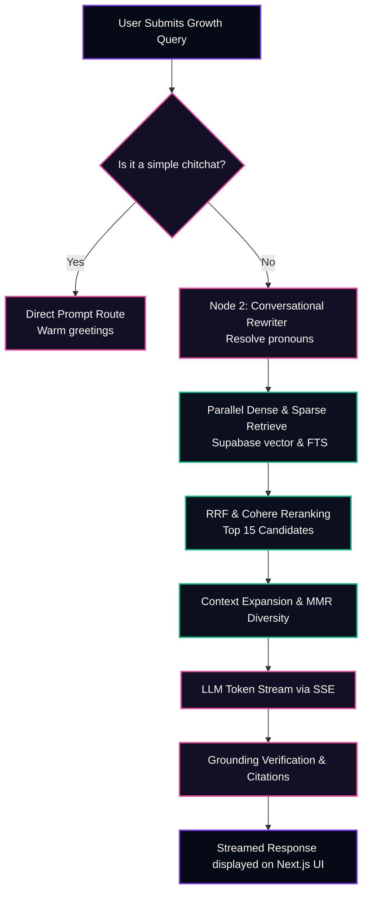
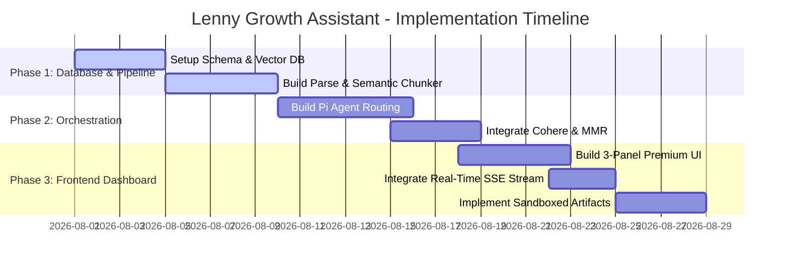

# 📋 Product Requirement Document (PRD): Lenny Growth Assistant

---

## Metadata Information
*   **Document Owner**: Hemang Jain
*   **Current Status**: Approved / Ready for Implementation
*   **Target Release Date**: August 28, 2026
*   **Key Stakeholders**:
    *   *Engineering Lead*: Hemang Jain
    *   *Design Lead*: Hemang Jain
    *   *Product Management / Marketing*: Lenny's Podcast Team

---

## 1. Problem Statement and Objective

### ❌ The Problem
Product Managers, Growth Marketers, and Startup Founders face a massive information-overload problem. **Lenny's Podcast** contains hundreds of episodes featuring top growth leaders, but extracting specific, high-fidelity business insights (such as growth benchmarks, onboarding models, or activation milestones) is exceptionally tedious. 
*   **Unstructured conversational noise** makes standard search engines obsolete.
*   **Traditional RAG tools** hallucinate quotes, suffer from "lost in the middle" context retrieval errors, misattribute frameworks to guests, and fail to provide exact citation validation.

### 🎯 Objective
To build an advanced, conversational growth assistant that indexes entire guest transcripts, enabling users to ask complex strategic questions and instantly receive streaming, fully cited answers with clickable YouTube timestamp links, accompanied by an interactive sidebar workspace (Claude-Style) for generating customized checklists, spreadsheets, or long-form strategic essays.

---

## 2. Target Audience (Personas)

### 🧑‍💼 Persona 1: Product Manager (Sarah)
*   *Role*: Senior PM at a Series A SaaS startup.
*   *Goals*: Find actionable benchmarks on activation, user onboarding, and retention curves.
*   *Frustrations*: Spends hours listening to episodes or scrolling through transcripts to find a single framework mentioned by a guest.

### 🧑‍💻 Persona 2: Growth Lead (David)
*   *Role*: Growth Marketer at a fast-growing consumer app.
*   *Goals*: Run quick experiments on cold-start problems and referral loops using verified frameworks from experienced operators.
*   *Frustrations*: Traditional AI engines generate generic advice. Needs the exact, real-world playbooks used by companies like Airbnb, Figma, or Slack.

### 🚀 Persona 3: Startup Founder (Elena)
*   *Role*: Solo Founder building an early-stage B2B tool.
*   *Goals*: Fast-track product-market fit milestones and set up pricing structures.
*   *Frustrations*: Cannot afford expensive advisory consultations. Needs expert, validated insights from PM leaders on demand.

---

## 3. Success Metrics (KPIs)

To evaluate the success of Lenny's Growth Assistant, we measure performance against these core technical and user-centric indicators:

| Category | Key Performance Indicator (KPI) | Target Success Criteria |
| :--- | :--- | :--- |
| **Search Relevancy** | Retrieval Precision | $> 95\%$ relevant context chunks pulled on initial fetch. |
| **Trustworthiness** | Hallucination Rate | $0\%$ ungrounded claims generated. All facts must align with sources. |
| **Response Latency** | Time to First Token (TTFT) | $< 250	ext{ms}$ through SSE token streaming. |
| **Verification** | Citation Accuracy | $100\%$ clickable citations mapping to the exact second in the video. |
| **Engagement** | Artifact Adoption Rate | $> 40\%$ of sessions leverage the interactive side panel. |

---

## 4. Scope and Requirements

### 📥 In Scope (V1)
*   **Hybrid Retrieval Engine**: Dual-lane retrieval combining Supabase `pgvector` dense search with PostgreSQL full-text sparse search, fused via **Reciprocal Rank Fusion (RRF)**.
*   **Context Expansion**: Automatically fetching preceding and succeeding dialog segments to maintain conversation continuity.
*   **Maximal Marginal Relevance (MMR)**: Filtering out redundant statements to preserve context-window space.
*   **Pi Agentic reasoning Loop**: Classifier, Conversational follow-up rewriter, and Query decomposer.
*   **Interactive Artifact panel**: Real-time extraction of `<artifact>` and `<ship30>` tags, rendered inside a sandboxed `<iframe>` layout.
*   **Exact Video Citation mapping**: Automatic timestamp-to-seconds conversion to build direct, clickable YouTube links.

### 🚫 Out of Scope (V1)
*   **Native Authentication**: Handled via simple browser local session caching for V1 to accelerate focus on RAG precision.
*   **Automated Audio Transcription**: Pipeline consumes pre-cleaned text transcripts. Auto-transcription from YouTube is planned for V2.
*   **Multi-tenant billing**: App is fully free/open-source for evaluation.

### 🛡️ Non-Functional Requirements
*   **Security & Sandbox Isolation**: Preview HTML must be rendered within an iframe stripped of `allow-same-origin` permissions to block any XSS vector.
*   **Performance (Asynchronous queries)**: All vector similarity and full-text databases queries must run in parallel to keep RAG latency under $2	ext{s}$ before streaming.
*   **Graceful Degrades**: Seamless fallback to Cloud Gemini if local Ollama servers exceed timeout thresholds.

---

## 5. User Experience and Product Flows

### 💬 1. Conversational Chat and RAG Flow

The journey of a user query from submission to verified, real-time streamed token responses:



---

### 🎨 2. Interactive Claude-Style Artifact Flow

How the frontend detects, extracts, and separates structured files into the workspace panel:

```mermaid
sequenceDiagram
    autonumber
    actor User as Client (Next.js UI)
    participant Pi as Pi Orchestrator (FastAPI)
    participant AP as Artifact Panel (UI)

    User ->> Pi: "Generate a B2B SaaS pricing model table"
    Pi ->> Pi: Retrieve context, RRF & MMR
    Pi ->> Pi: Inject specialized Artifact Skill Prompts
    Note over Pi: Formulates output structured inside <artifact> tags
    
    loop Real-time SSE Token Stream
        Pi -->> User: "```xml
<artifact title='Pricing Table' type='html'>..."
        Note over User: Frontend scanner detects XML tag in stream
        User ->> AP: Slide Open Workspace Panel in real-time
        User ->> AP: Stream raw content into Code Mode
    end
    
    Pi -->> User: "</artifact>```"
    Note over User: Tag closes. Streaming completes.
    User ->> AP: Compile markdown headers to Table of Contents
    User ->> AP: Render preview inside isolated sandboxed iframe
    User ->> AP: Enable Copy / Export buttons
```

---

## 6. Acceptance Criteria

*   **AC 1: Precision Retrieval**: For any query referencing a specific guest (e.g. "Anya Smith's cold start"), the retrieved context must prioritize that guest's transcript chunks above others.
*   **AC 2: Zero Hallucination Guardrail**: The assistant must decline answering or politely explain if no relevant discussion was found inside the database instead of using pre-trained general knowledge.
*   **AC 3: Real-Time Streaming**: Content must stream token-by-token using SSE with a Time to First Token (TTFT) under $300	ext{ms}$.
*   **AC 4: Verified Citations**: Every factual growth assertion must include a clickable citation linked directly to the correct timestamp second on YouTube (`&t=X` format).
*   **AC 5: Secure Artifact Rendering**: Generated HTML pages must run scripts safely inside an isolated sandboxed context, totally separated from the parent DOM, cookie, or API session scope.

---

## 7. Risks and Mitigation Strategies

*   **Risk 1: Prompt Injection Vectors**  
    *Mitigation*: Implement strong XML containment blocks around fetched contexts with double reinforcement prompts (Sandwich Prompting) to reject any embedded user instructions.
*   **Risk 2: High API Latency**  
    *Mitigation*: Run all database retrievals and external embedding calls concurrently using asynchronous asyncio functions, streaming tokens instantly before waiting for the entire document to compile.
*   **Risk 3: Model Hallucinations in Citations**  
    *Mitigation*: A dedicated grounding verifier compares generated citations with the raw database `start_timestamp_seconds` field, automatically correcting or suppressing bad links before rendering.

---

## 8. Implementation Plan



---
