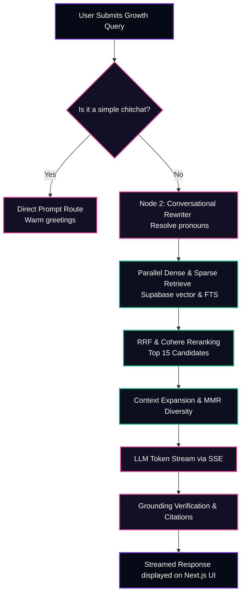

# 📋 Product Requirement Document (PRD): Lenny Growth Assistant

---

## Metadata Information
*   **Document Owner**: Hemang Jain
*   **Deployed Link**: https://lenny-assisstant.vercel.app/ 
*   **Submission Date**: August 28, 2026

---

## 1. Problem Statement and Objective

### The Problem
Product Managers, Growth Marketers, and Startup Founders face a massive information-overload problem. **Lenny's Podcast** contains hundreds of episodes featuring top growth leaders, but extracting specific, high-fidelity business insights (such as growth benchmarks, onboarding models, or activation milestones) is exceptionally tedious. 
*   **Unstructured conversational noise** makes standard search engines obsolete.
*   **Traditional RAG tools** hallucinate quotes, suffer from "lost in the middle" context retrieval errors, misattribute frameworks to guests, and fail to provide exact citation validation.

### Objective
To build an advanced, conversational growth assistant that indexes entire guest transcripts, enabling users to ask complex strategic questions and instantly receive streaming, fully cited answers with clickable YouTube timestamp links, accompanied by an interactive sidebar workspace (Claude-Style) for generating customized checklists, spreadsheets, or long-form strategic essays.

---

## 2. Target Audience (Personas)

### 🧑‍💼 Persona 1: Product Manager (Sarah)
*   *Role*: Senior PM at a Series A SaaS startup.
*   *Goals*: Find actionable benchmarks on activation, user onboarding, and retention curves.
*   *Frustrations*: Spends hours listening to episodes or scrolling through transcripts to find a single framework mentioned by a guest.

### 🧑‍💻 Persona 2: Growth Lead (David)
*   *Role*: Growth Marketer at a fast-growing consumer app.
*   *Goals*: Run quick experiments on cold-start problems and referral loops using verified frameworks from experienced operators.
*   *Frustrations*: Traditional AI engines generate generic advice. Needs the exact, real-world playbooks used by companies like Airbnb, Figma, or Slack.

### 🚀 Persona 3: Startup Founder (Elena)
*   *Role*: Solo Founder building an early-stage B2B tool.
*   *Goals*: Fast-track product-market fit milestones and set up pricing structures.
*   *Frustrations*: Cannot afford expensive advisory consultations. Needs expert, validated insights from PM leaders on demand.

---

## 3. Success Metrics (KPIs)

To evaluate the success of Lenny's Growth Assistant, we measure performance against these core technical and user-centric indicators:

| Category | Key Performance Indicator (KPI) | Target Success Criteria |
| :--- | :--- | :--- |
| **Search Relevancy** | Retrieval Precision | $> 95\%$ relevant context chunks pulled on initial fetch. |
| **Trustworthiness** | Hallucination Rate | $0\%$ ungrounded claims generated. All facts must align with sources. |
| **Response Latency** | Time to First Token (TTFT) | $< 250	ext{ms}$ through SSE token streaming. |
| **Verification** | Citation Accuracy | $100\%$ clickable citations mapping to the exact second in the video. |
| **Engagement** | Artifact Adoption Rate | $> 40\%$ of sessions leverage the interactive side panel. |

---

## 4. Scope and Requirements

### 📥 In Scope (V1)
*   **Hybrid Retrieval Engine**: Dual-lane retrieval combining Supabase `pgvector` dense search with PostgreSQL full-text sparse search, fused via **Reciprocal Rank Fusion (RRF)**.
*   **Context Expansion**: Automatically fetching preceding and succeeding dialog segments to maintain conversation continuity.
*   **Maximal Marginal Relevance (MMR)**: Filtering out redundant statements to preserve context-window space.
*   **Pi Agentic reasoning Loop**: Classifier, Conversational follow-up rewriter, and Query decomposer.
*   **Interactive Artifact panel**: Real-time extraction of `<artifact>` and `<ship30>` tags, rendered inside a sandboxed `<iframe>` layout.
*   **Exact Video Citation mapping**: Automatic timestamp-to-seconds conversion to build direct, clickable YouTube links.

### 🚫 Out of Scope (V1)
*   **Native Authentication**: Handled via simple browser local session caching for V1 to accelerate focus on RAG precision.
*   **Automated Audio Transcription**: Pipeline consumes pre-cleaned text transcripts. Auto-transcription from YouTube is planned for V2.
*   **Multi-tenant billing**: App is fully free/open-source for evaluation.

### 🛡️ Non-Functional Requirements
*   **Security & Sandbox Isolation**: Preview HTML must be rendered within an iframe stripped of `allow-same-origin` permissions to block any XSS vector.
*   **Performance (Asynchronous queries)**: All vector similarity and full-text databases queries must run in parallel to keep RAG latency under $2	ext{s}$ before streaming.
*   **Graceful Degrades**: Seamless fallback to Cloud Gemini if local Ollama servers exceed timeout thresholds.

---

## 5. User Experience and Product Flows

### 💬 1. Conversational Chat and RAG Flow

The journey of a user query from submission to verified, real-time streamed token responses:

---

### 🎨 2. Interactive Claude-Style Artifact Flow

The frontend continuously monitors the live SSE token stream for structured artifact markers, allowing the assistant to separate reusable work products from ordinary chat responses. When the orchestrator produces a payload such as `<artifact title="Pricing Table" type="html">...`, the client immediately detects the tag boundaries, opens the workspace panel, and streams the raw document content into a dedicated code editor or artifact buffer.

This is intentionally designed to move beyond a standard chat experience. The user is not forced to wait for the entire response to finish before interacting with a usable artifact. Instead, the assistant can generate a pricing sheet, checklist, planner, or strategic memo while the frontend progressively captures, validates, and surfaces the output in a side panel.

The implementation approach is as follows:

*   The backend composes artifact content inside explicit XML-like tags, ensuring structure is machine-readable and easy to parse.
*   The frontend scanner watches the incoming stream for opening and closing tag boundaries, preserving partial content as it arrives.
*   Once the artifact is detected, the panel opens in real-time and displays the raw payload in editable code mode, preserving the original structure for further refinement.
*   Markdown headers or semantic sections are extracted to populate a side navigation or table of contents, making large outputs easier to scan.
*   The rendered preview is isolated inside a sandboxed iframe with restricted permissions to prevent script execution and reduce XSS risk.
*   A separate copy/export flow lets the user duplicate, modify, or download the artifact without leaving the conversational context.

The intent is to transform generated insights into concrete, reusable strategic assets rather than ephemeral text. In practical terms, this allows a user to ask for a pricing model, benchmark table, onboarding checklist, or growth experiment plan and immediately work with a structured artifact in a Claude-style workflow while the conversation continues.

## 7. Risks and Mitigation Strategies

*   **Risk 1: Prompt Injection Vectors**  
    *Mitigation*: Implement strong XML containment blocks around fetched contexts with double reinforcement prompts (Sandwich Prompting) to reject any embedded user instructions.
*   **Risk 2: High API Latency**  
    *Mitigation*: Run all database retrievals and external embedding calls concurrently using asynchronous asyncio functions, streaming tokens instantly before waiting for the entire document to compile.
*   **Risk 3: Model Hallucinations in Citations**  
    *Mitigation*: A dedicated grounding verifier compares generated citations with the raw database `start_timestamp_seconds` field, automatically correcting or suppressing bad links before rendering.
