# 🎨 Lenny Growth Assistant - Next.js Frontend Dashboard

This directory contains the production-optimized, highly responsive **Next.js** and **Tailwind CSS** frontend that powers the **Lenny Growth Assistant**. It is crafted with a premium dark-violet visual aesthetic, featuring a seamless three-column workspace layout, live-streaming status events, and interactive Claude-style artifact views.

---

<p align="center">
  
  
  
  
</p>

---

## ── 1. FRONTEND DATA FLOW & ARCHITECTURE

The frontend app layout features a premium dark-violet glassmorphism dashboard. It interacts with the FastAPI SSE (Server-Sent Events) backend through a real-time reactive architecture. The complete state, streaming, and UI layout flow are described in the Mermaid diagram below:

```mermaid
flowchart TD
    %% Define Styles
    classDef ui fill:#050914,stroke:#7C3AED,stroke-width:2px,color:#fff;
    classDef logic fill:#131026,stroke:#EC4899,stroke-width:2px,color:#fff;
    classDef server fill:#0A0F1D,stroke:#10B981,stroke-width:2px,color:#fff;
    classDef panel fill:#181532,stroke:#06B6D4,stroke-width:2px,color:#fff;

    %% Nodes
    A[User Types Prompt in ChatComposer]:::ui --> B[Submit Chat Request via API]:::logic
    B --> C[FastAPI Server-Sent Events SSE Stream]:::server
    
    C -- 1. SSE Status Chunks --> D[Update Honing Reasoning Widget]:::ui
    C -- 2. SSE Content Tokens --> E[Append Word-by-Word Chat Stream]:::ui
    C -- 3. SSE XML tags: artifact/ship30 --> F[Extract XML Content in real-time]:::logic
    
    F --> G[Slide Open Interactive Artifact Panel]:::panel
    
    %% Artifact Interactions
    G --> H[Preview Mode: Render HTML inside Sandboxed iframe / Markdown Editor]:::panel
    G --> I[Code Mode: View syntax-highlighted source code]:::panel
    G --> J[Dynamic Section Navigator: Dynamic Table of Contents sidebar with 1-click smooth scroll]:::panel
    G --> K[Export Actions: Copy-to-Clipboard / Download .html or .md files]:::panel

    %% Responsive styling
    style D fill:#1e1a3a,stroke:#EC4899
    style E fill:#1e1a3a,stroke:#EC4899
    style G fill:#092230,stroke:#06B6D4
```



---

## 📸 Dashboard Interface Preview

Below is a preview of the **Lennys Growth Assistant** dashboard, showcasing the dark-violet glassmorphism workspace, interactive Chat interface, and the sliding Artifact Panel with dynamic Table of Contents navigation:

<p align="center">
  
</p>

---

## ── 2. KEY FEATURES

*   **📱 3-Panel Professional Layout**:
    - **Sidebar (Left Panel)**: Houses glowing brand headers (`> LennyGPT`), a gradient `[ + New Chat ]` creator, favorites filters, chronological session grouping (`Today`, `Yesterday`, `Earlier`), and a user profile card.
    - **Chat Workspace (Center Panel)**: Clean, borderless AI responses with markdown support, an expandable **Honing Reasoning Widget**, and an integrated Chat Composer at the bottom.
    - **Artifact Slide-Over Panel (Right Panel)**: Automatically slides into view whenever a structured essay, PM checklist, or custom template is generated.
*   **🤖 Honing Reasoning Widget**: Integrates with SSE (Server-Sent Events) backend signals. It displays the active retriever stages, search configurations, matching discussion items, and clickable YouTube timestamp links that play from the exact second.
*   **📋 Claude-Style Artifact Viewer**:
    - **Preview Mode**: Clean, beautiful published editorial layouts for growth checklists, newsletters, or playbooks.
    - **Code Mode**: Toggle seamlessly to inspect the raw unrendered Markdown or HTML code.
    - **Dynamic TOC Sidebar**: Auto-parses Markdown headings (`#`, `##`, `###`) to compile a hyper-focused Table of Contents navigation with 1-click smooth scrolling.
    - **Actions**: Offers 1-click Copy-to-clipboard and exporting to `.md` or `.html` file blobs.
*   **🌓 Theme Controls**: Features a seamless toggle on the navbar to switch between the premium deep dark violet palette and a high-contrast slate light mode layout.

---

## ── 3. LOCAL MANUAL STARTUP (FOR DEVELOPMENT)

### 1. Install Node.js Dependencies
Make sure you have Node.js 18+ installed on your system. Navigate to the `frontend` folder and run:
```bash
cd frontend
npm install
```

### 2. Configure Environment Variables
Copy `.env.example` to `.env` (or `.env.local` for Next.js-native loading) with preconfigured defaults pointing to your FastAPI backend:
```bash
cp .env.example .env
```

### 3. Boot the Next.js Dev Server
```bash
npm run dev
```
Open [http://localhost:3000](http://localhost:3000) in your browser to view the application.

---

## ── 4. PRODUCTION DOCKER DEPLOYMENT

The frontend utilizes a multi-stage Docker build that leverages Next.js **`standalone`** output configuration. This strips away all unnecessary node files, shrinking the final production image size by over 90% for lightning-fast deployments.

```bash
# Build the production image
docker build -t lenny-frontend .

# Run the container
docker run -p 3000:3000 -e NEXT_PUBLIC_API_URL=http://localhost:8000 lenny-frontend
```

---

## ── 5. STACK DETAILS

- **Framework**: Next.js 14 (App Router)
- **Styling**: Tailwind CSS & Glassmorphic variables in `app/globals.css`
- **Icons**: Lucide React
- **Markdown Rendering**: `react-markdown`
